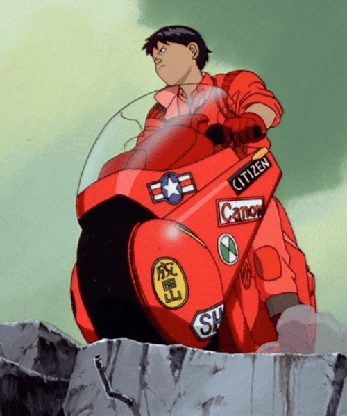

### Wassup?! I'm Vitor Dubiela 👋

# About ME 💬 :

- 🔭 I’m currently working on [BNE](https://www.bne.com.br)
- 🌱 I’m currently learning ...
- 👯 I’m looking to collaborate on ...
- 💬 Ask me about ...
- 📫 How to reach me: ...
- 😄 Pronouns: he/him
- ⚡ Fun fact: sometimes Rhaast, sometimes Blue Kayn :flushed:

  <a target="_blank" href="https://www.linkedin.com/in/vitor-hugo-santos-dubiela-7b04b2190"></img></a>
<a target="_blank" href="mailto:vitorhugo.dubiela@gmail.com"></img></a>

 
 
 
 
 

  <a href="https://github.com/Vitor-Dubiela">
  
  

